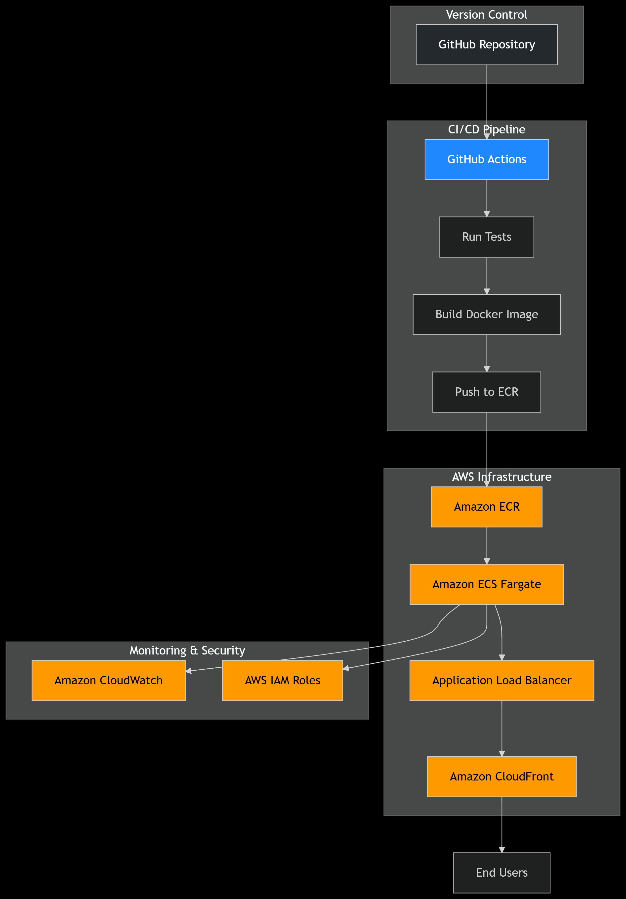

# CI/CD Pipeline for Python Web App on AWS

## 📋 Overview

A complete CI/CD pipeline for a Python Flask web application deployed on AWS using modern DevOps practices. This implementation automates the entire process from code commit to production deployment with built-in testing, monitoring, and rollback capabilities.

## 🏗️ Architecture Diagram


```

## 🛠️ Technology Stack

### **CI/CD Tools**
- **GitHub Actions**: Automated workflow orchestration
- **Docker**: Containerization for consistent deployments
- **Terraform**: Infrastructure as Code (IaC) for reproducible environments

### **AWS Services**
- **ECR (Elastic Container Registry)**: Docker image storage
- **ECS Fargate**: Serverless container orchestration
- **Application Load Balancer**: Traffic distribution and health checks
- **CloudFront**: Global content delivery and caching
- **CloudWatch**: Monitoring and logging
- **IAM**: Secure access management

### **Application Framework**
- **Python 3.9**: Runtime environment
- **Flask**: Web application framework
- **Gunicorn**: Production WSGI server
- **Pytest**: Testing framework

## 🎯 Why This Stack?

### **GitHub Actions**
- **Seamless Integration**: Native GitHub integration with no additional setup
- **Cost Effective**: Free for public repositories with generous limits
- **Extensive Ecosystem**: Large marketplace of pre-built actions
- **Windows Support**: Native Windows runner support for testing

### **Terraform**
- **Multi-Cloud Ready**: Works across cloud providers
- **Declarative Syntax**: Easy to understand and maintain
- **State Management**: Built-in state tracking and locking
- **Community Support**: Large module ecosystem

### **AWS ECS Fargate**
- **Serverless**: No infrastructure management required
- **Cost Optimized**: Pay only for resources consumed
- **Auto-Scaling**: Built-in scaling capabilities
- **Security**: Runs in isolated environments

### **Python & Flask**
- **Lightweight**: Minimal overhead for web applications
- **Developer Friendly**: Easy to learn and maintain
- **Extensible**: Rich ecosystem of extensions
- **Production Ready**: Battle-tested in production environments

## 📁 Repository Structure

```
/
├── .github/workflows/
│   └── ci-cd-pipeline.yml          # GitHub Actions workflow
├── infrastructure/
│   ├── main.tf                     # Primary Terraform configuration
│   ├── variables.tf                # Terraform variables
│   ├── outputs.tf                  # Terraform outputs
│   └── backend.tf                  # Terraform state configuration
├── app/
│   ├── app.py                      # Flask application
│   ├── requirements.txt            # Python dependencies
│   ├── Dockerfile                  # Container definition
│   └── tests/
│       ├── __init__.py             # Test package initialization
│       └── test_app.py             # Application tests
├── scripts/
│   ├── rollback.ps1                # Windows rollback script
│   ├── create-ecr.ps1              # ECR setup script
│   └── test-local.ps1              # Local testing script
└── README.md                       # This file
```

## 🚀 Deployment Process

### **1. Code Commit**
```bash
git add .
git commit -m "feat: new feature implementation"
git push origin main
```

### **2. Automated Testing**
- Python unit tests executed on Windows runner
- Dependency installation and validation
- Test results reported back to GitHub

### **3. Infrastructure Provisioning**
- Terraform plans and applies AWS infrastructure
- ECR repository creation
- ECS cluster and service setup
- Load balancer and CloudFront configuration

### **4. Container Build & Deployment**
- Docker image built and tagged
- Image pushed to ECR
- ECS service updated with new task definition
- Zero-downtime deployment with health checks

### **5. Verification & Rollback**
- Automated health check validation
- Rollback triggered automatically on failure
- Previous stable version restored

## 🛡️ Security Features

- **Least Privilege IAM Roles**: Minimal permissions for each component
- **No Hardcoded Secrets**: All credentials via GitHub Secrets
- **Container Isolation**: Applications run in isolated environments
- **Encrypted Storage**: ECR images encrypted at rest
- **Security Groups**: Network traffic restricted to necessary ports

## 📊 Monitoring & Logging

- **CloudWatch Logs**: Centralized logging for all containers
- **Health Checks**: Automated application health monitoring
- **Performance Metrics**: CPU, memory, and network monitoring
- **Access Logs**: ALB and CloudFront access logging

## 🔧 Setup Instructions

### **Prerequisites**
- AWS Account with appropriate permissions
- GitHub Repository
- AWS CLI configured locally
- Terraform installed (for local testing)

### **1. Repository Setup**
```bash
git clone <your-repository-url>
cd <repository-directory>
```

### **2. AWS Configuration**
```bash
aws configure
# Enter your AWS credentials when prompted
```

### **3. GitHub Secrets Setup**
Add these secrets to your GitHub repository settings:

| Secret Name | Description |
|-------------|-------------|
| `AWS_ACCESS_KEY_ID` | AWS access key ID |
| `AWS_SECRET_ACCESS_KEY` | AWS secret access key |
| `AWS_REGION` | AWS region (us-east-1) |

### **4. Manual Infrastructure Setup (Optional)**
```bash
cd infrastructure
terraform init
terraform plan
terraform apply
```

### **5. Trigger Pipeline**
Push to main branch to trigger automated deployment:
```bash
git push origin main
```

## 🧪 Testing the Application

### **Demo Account**
The application includes a demo login endpoint:

- **Email**: `hire-me@anshumat.org`
- **Password**: `HireMe@2025!`

### **Health Check**
```bash
curl https://your-cloudfront-domain/health
# Expected response: {"status": "healthy"}
```

### **Main Endpoint**
```bash
curl https://your-cloudfront-domain/
# Expected response: Welcome message with version info
```

## 🔄 Rollback Process

### **Automatic Rollback**
- Triggered on deployment failure
- Restores previous working version
- Monitors service stability

### **Manual Rollback**
```bash
# Run the rollback script
.\scripts\rollback.ps1
```

## 🧹 Cleanup

To avoid ongoing costs, destroy the infrastructure when not in use:

```bash
cd infrastructure
terraform destroy
```

## 🆘 Troubleshooting

### **Common Issues**

1. **ECR Repository Already Exists**
   - Solution: Terraform will reuse existing repository

2. **ECS Cluster Not Found**
   - Solution: Infrastructure job creates cluster automatically

3. **Permission Errors**
   - Solution: Verify IAM roles and GitHub secrets

4. **Test Failures**
   - Solution: Check test logs in GitHub Actions

### **Debugging Tips**

- Check GitHub Actions logs for detailed error messages
- Verify AWS resources in Console
- Test locally using provided scripts
- Check CloudWatch logs for application errors

## 📈 Performance Features

- **Global CDN**: CloudFront for reduced latency
- **Auto-Scaling**: ECS service auto-scaling capabilities
- **Caching**: CloudFront and ALB caching layers
- **Load Distribution**: ALB traffic distribution across containers

## 🤝 Contributing

1. Fork the repository
2. Create a feature branch
3. Make changes and add tests
4. Submit a pull request
5. Automated pipeline will validate changes

## 📞 Support

For issues with this implementation:

1. Check GitHub Actions logs
2. Review CloudWatch application logs
3. Verify Terraform state and resources
4. Consult AWS documentation for specific services

---

**Note**: This implementation follows AWS best practices for security, reliability, and performance. All infrastructure is defined as code for reproducibility and version control.